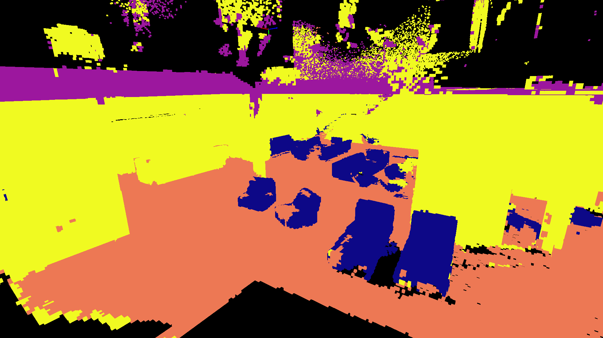
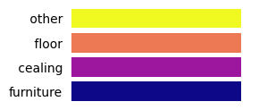
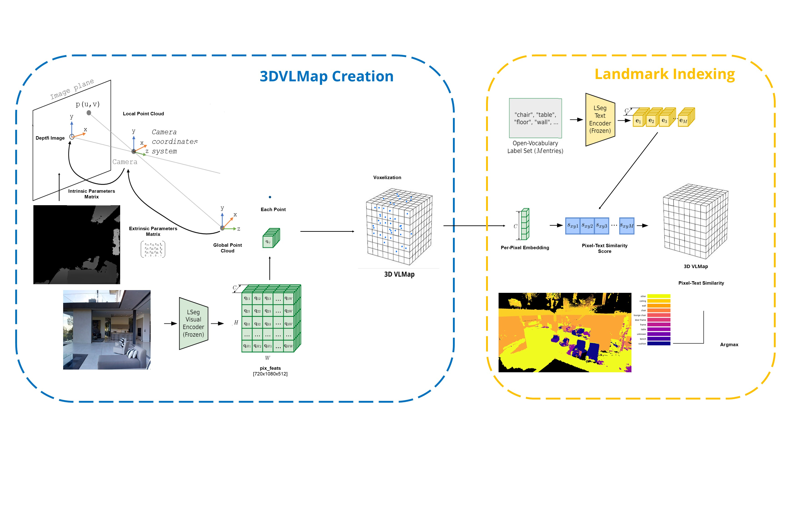
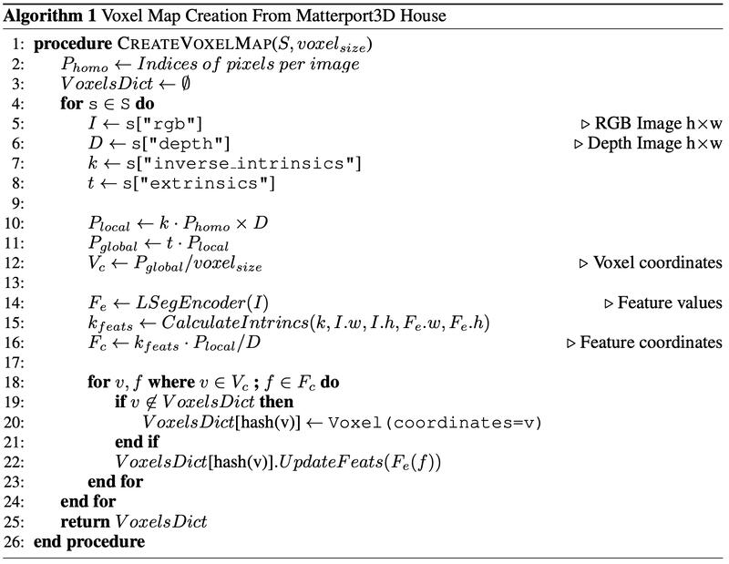

# 3DVLMaps

Built on top of:
[<b>Visual Language Maps for Robot Navigation</b>](https://arxiv.org/pdf/2210.05714.pdf)

We present a 3D representation of VLMaps to enhance robot navigation and understanding. Traditional VLMaps embed pretrained visuallanguage features into a 2D, top-down map. However, this top-down representation is limited in its ability to understand and navigate complex environments with occlusions and vertical structures. Our approach utilizes a voxel grid representation to construct a 3D semantic map enriched with visual-language features.

This allows robots to interpret instructions involving objects located beneath or obscured by other objects, which is not feasible with 2D VLMaps.
We implement our 3DVLMaps using the Open3D library for 3D data processing, incorporating a voxelization algorithm to create the 3D map from point clouds derived from the Matterport3D dataset. Semantic embeddings are integrated using the LSeg image encoder, while text features are obtained from a CLIP text encoder. To address noise and misclassifications in the initial voxel map, we apply a smoothing algorithm that averages feature embeddings of neighboring voxels.

Experimental results demonstrate that our 3DVLMaps achieve high segmentation accuracy for several objects such as couches, tables, bikes, and chairs. This work advances the capabilities of robotic systems in understanding and navigating 3D spaces.





# Approach






# Environment + Setup

To begin on your own machine, clone this repository locally
```bash
git clone https://github.com/3DVLMapsOrg/3Dvlmaps.git
```
Install requirements:
```bash
$ conda create -n 3dvlmaps python=3.8 -y  # or use virtualenv
$ conda activate 3dvlmaps
$ conda install jupyter -y
$ cd 3dvlmaps
$ bash install.bash
```

After environment setup, run
- download-mp.py to download matterport data, place a downloaded scan id such as 5LpN3gDmAk7_1 inside the data directory
- check that demo_e200.ckpt is inside lseg/checkpoints directory. This is the LSeg model that is used for segmentation